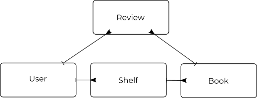

# Simple API server for Soroco

# Database

# API Endpoints
## User management
* `/signup`
  `POST` - Creates new user and redirects to user page
* `/login`
  `POST` - Creates a session and returns an expirable token
