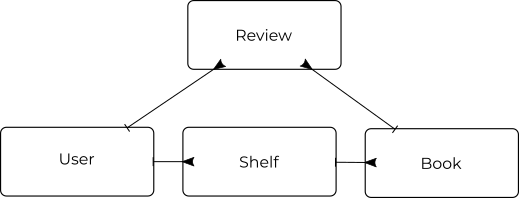

# Simple API server for Soroco

# Database

# API Endpoints
## User management
* `/api/user`
  `POST` - Creates new user and redirects to user page
* `/api/token`
  `GET` -  returns a auth token that will expire
